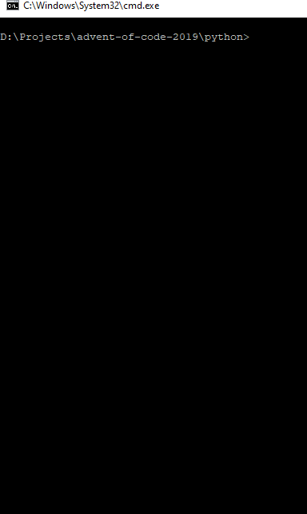

# advent-of-code-2019

## Day 1

He-he, looks simple, good chance to start in two programming languages :)

## Day 13

So much fun realizing that 7Kb of integers can really play Arcanoid! Amazing!

## Day 17

I need to stop overthinking this stuff! Cannot believe the part 2 solution was so easy! I spent several hours trying to manually find the sequence and miserably failed. Started to think about possible program transformations (i.e. `R10 == R8 L R 2` and similar), but still cannot believe it turned out to be so much simpler...